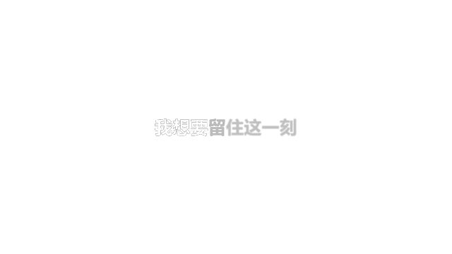
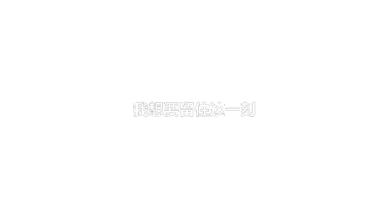
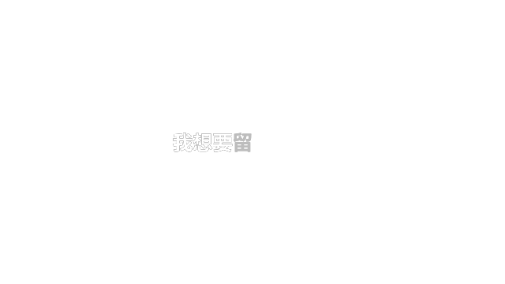

# 0.5.0 重构候选版验证状态

**本轮尚未通过完整图像和实时性能验收，不能把下方旧版 PNG 当作新版本效果。**

## 已通过

- Python/Lua：28 项测试，覆盖亮暗状态、字符区间无重复／遗漏、词宽扫描所用状态、CSS ease-out、跨切词上浮、强调错落、句尾／和声参数、长段容量、倒放跳帧、非整数帧率和部分导出时间基准。
- JavaScript：32 项歌词解析／导入回归；全部 JS 语法检查。
- 恢复默认按钮的回调在 Resolve 实际宏对象执行：Size 从 0.2 回到 0.075，Glow 从 2 回到 1，Lyrics／Offset 保持不变。
- 分段按钮回调在实际宏对象执行：`abc|def` 的 2–5 选区变成 `a|bc|de|f`，`0-3|5-8` 拆成四段并保留 3–5 秒空拍。
- 原生输入确认：外层宏可读取 `ResetDefaults`，显示名为“恢复默认效果（保留歌词和时间）”。这不是鼠标点击检查器的 UI 验收。
- 初始隔离测试成功导出真实 Text+ 全句／单字符 PNG，证实 Start/End 保持真实字形位置；读到所截取字符的 DataWindow。
- 使用本机原生模板和注册节点确认 Custom Tool 的类型 ID 为 `Custom`，不是 `CustomTool`。候选源码已修正。
- Windows PowerShell 5.1：启动器 `-CheckOnly`；自定义测试目录首次安装、重复安装与 D 盘备份；WhatIf 不改变安装。
- 启动回归覆盖空环境变量目录误判、BOM 路径提示、官方 SDK 替换模块对象、Lua 入口引号和完整包包含共享安装器。
- 配置仅在当前进程生效的 Python / Resolve DLL 搜索目录后，独立 Python 宿主已成功连接本机 Resolve 并读取时间线信息；未据此声称时间线写入成功。
- 已将启动修复安装到本机 Lua 菜单入口；旧 Python 入口和旧应用已备份到 `D:\CodexBackup`。本轮没有覆盖本机正式标题模板。

## 未通过／仍待执行

- 首次重构原生导入使用了错误的 CustomTool 名称，产生 Dummy 节点，已修复源码；之后项目保存、渲染队列和切换 API 不再返回结果，原因尚未确认，不能断言是某种弹窗。
- 尝试直接 Fusion 渲染曾返回成功，但该次宏仍带旧状态定义，不能作为当前候选版图像证据；后续以脚本重建平面图也未形成有效完整输出。
- 因而**新版本的实际亮暗边界、光晕形状、上浮观感、默认包导入、全帧率和 4K 实时性能尚未验收**。
- 没有调用 Computer Use；没有自动处理 Resolve 弹窗，也没有强制退出进程。
- 本轮测试只在 `AMLL Rebuild QA 1789832873` 隔离工程进行；用户原工程已先保存并导出到 `D:\CodexBackup`。脚本尝试切回原工程没有收到成功确认，结束前仍需在 Resolve 中检查工程状态。
- Lua 菜单经重新启动后的实际显示、点击启动 Electron、完整时间线写入仍需 GUI／宿主回归；`-CheckOnly` 不等于完整启动成功。
- Free、Resolve 19、macOS、HDR、复杂字形簇、多行跨词扫描均未验证。

## 安全续测

1. 先处理 Resolve 中可能存在的待确认界面，不要在未保存的正式工程上继续试验。
2. 在独立 QA 工程重新导入最新 0.5.0 setting，检查没有 Dummy／报错节点，控制器状态包含 WordFirst／WordLast 等新字段。
3. 导出全段帧序列而非只看静帧；对比已唱内部 alpha、未唱 alpha、词内前沿和浮起位移。
4. 测试英文 `Wi`、中文长音、空拍、逐字时间、同词变宽字体、不同分辨率／帧率以及恢复默认按钮。
5. 最后测量缓存关闭时的帧率，再决定是否将此候选标题覆盖正式安装。

---

# 旧版验证记录（历史）

日期：2026-09-19。宿主：Windows，DaVinci Resolve **Studio 20.3.2.0009**。

## 已执行

### 源码 / 自动测试

- `python tools/build.py` 生成中文／英文两个单模板 setting 与独立 DRFX。
- `python -m unittest discover -s tests -v`：15 项新版标题测试通过。
- 直接执行 Lua 5.1 分段逻辑，覆盖中文、标点、空格、CRLF、空段、非法时间、重叠时间、空拍、容量边界、整体偏移、非零 RenderStart、常见整数与非整数帧率、平滑过渡单调性。
- 校验所有生成的表达式语法、原生节点连接目标、宏暴露的输入、DRFX 目录与 CRC、源码 / dist 一致性。
- PowerShell 5.1 安装脚本：验证 WhatIf、测试目录首次安装、重复安装前备份和 SHA256 比对。
- **没有用 mock 冒充 Resolve 图像验证。** 自动化 Lua 测试不负责验证字体渲染、Write On 字形索引或 GPU。

### 原生 Resolve 检查与真实导出

在独立的、仅包含合成测试素材的 QA 项目中：

1. 通过 `bmd.readfile` 解析生成的 setting。
2. 从原生 TextPlus 读取参数列表，确认 Start / End 等实际输入。
3. 通过时间线 `ImportFusionComp` 导入生成的节点结构，连接 MediaOut。
4. 通过 **宏公开参数** 修改 Timings / Offset / IdleOpacity / Lyrics / Size。
5. 在 640×360、24 fps 时间线导出 PNG RGBA，检查真实图像。

| 场景 | 结果 |
| --- | --- |
| 单模板默认中文，0 帧 | 整句低亮且有轻微模糊 |
| 单模板默认中文，48 帧 | 前半句亮起，后半句低亮 |
| 单模板默认中文，110 帧 | 整句清晰、高亮 |
| 自定义四段，IdleOpacity=0，0 帧 | 全部透明，RGBA alpha 极值均为 0 |
| 自定义四段，IdleOpacity=0，48 帧 | “我想要”已出现，“留”正在变亮，后文未出现 |
| 自定义四段，110 帧 | 整句出现 |
| 时间数量错误，0 帧 | Status 报错；全句静态显示，不丢词 |
| 英文 Hello + 空格 + world | 中间帧只亮起前词，末帧完整显示 |
| 英文语言包 | 正常导出，与 单模板默认画面一致 |
| 长句缩小字号后末帧 | 正常导出，全句落在画面内 |

真实导出预览（保留透明通道，建议在深色背景观看）：

| 未唱 | 唱到一半 | 唱完 |
| --- | --- | --- |
|  |  |  |

逐字出现的中间状态：

### 证据边界

- 以上是实际 Resolve 时间线导出，不是 HTML 模拟，也不是 AI 生成效果图。
- 未启用 Computer Use；没有做鼠标拖入或检查器布局的界面测试。
- 19、免费版和其他操作系统没有实机验证。
- 测试分辨率不代表 4K 或长段字幕的实时播放性能。
- 初期无界面独立合成测试曾失败；后续以时间线导入和实际导出作为结果依据，详情见 research.md。

## 用户端验收清单

在空白工程中完成以下检查，尤其是 19 或免费版：

- [ ] 重启后效果库只出现一个 AM Lyrics，不再出现 32 / 64。
- [ ] 拖入后默认中文正常显示，无红色报错节点或字体缺失。
- [ ] 控制 / Style 两页参数清楚可用，颜色选择器、字体字重配对正常。
- [ ] 修改歌词，无需进入 Fusion 即能生效。
- [ ] 删除 Timings 后自动均分；重新输入四组时间后跟随四段节奏。
- [ ] Idle opacity=0 时从不可见逐字出现。
- [ ] 播放时整句不整体闪动，当前字不发生缩放或位移。
- [ ] 当前字光晕只落在当前字符附近，不产生长拖影、不反复跳变。
- [ ] 高亮与未唱文字的边界清楚，默认字形不被光晕改变。
- [ ] 改 Idle blur / Active blur 对应影响未唱 / 已唱文字。
- [ ] 粗体、普通字重、颜色、字号、位置、字距可调整。
- [ ] 设置非法时间时 Status 提示，文字不截断。
- [ ] 复制片段，各实例修改互不影响。
- [ ] 24 / 30 / 60 fps 工程、剪辑裁剪、Fusion 缓存、最终导出都与预期一致。
- [ ] 如需要换行、Emoji、组合音标、连字，逐一验证，不默认承诺支持。

## 避免误用

不要在保存当前正式工程前做未知版本的首次插件验收。遇到问题先给出 Resolve 版本、预设名、Lyrics、Timings、FPS，以及报错节点或截图。

## Scripts 插件时间线导入验证（2026-09-19）

- 插件离线测试增至 32 项，覆盖歌词范围重新对齐、逐字时间写入、逐行降级、256 字符上限和重叠轨道分配。
- 在本机 Resolve Studio 20.3.2 的隔离 QA 项目中验证公开 API 链路：按指定帧数实例化 `AM Lyrics`、写入宏控件、转换为媒体池 Fusion 源、精确追加到最高轨道之上的新轨道，并把多句合并为单一 Fusion 片段。
- QA 脚本完成后删除本轮临时时间线、媒体项和文件夹；没有在用户项目上执行破坏性测试。
- 尚未调用 Computer Use 完成插件 UI 点击回归；普通 Scripts 入口改造后的实际菜单和时间线写入由用户在本机验收。
- 2026-09-19 直接替换用户模板文件后，当前已运行的 Resolve 进程仍保留旧的标题目录缓存；`InsertFusionTitleIntoTimeline("AM Lyrics")` 在不重启 Resolve 时可能得到空 Fusion 合成。安装器因此要求重启 Resolve；重启后再验收标题目录。
- 已通过 `ImportFusionComp` + 项目 PNG 渲染验证此前单模板图像输出；本轮修复将当前字改为静态字形、移除独立 CurrentBlur，并需要重启 Resolve 后重新验收。

详见 [`workflow-plugin/docs/verification.md`](../workflow-plugin/docs/verification.md)。

## 普通 Scripts 入口（2026-09-19）

由于用户环境的 Resolve 20 没有“工作区 → 工作流程集成”菜单，当前插件入口改为 **工作区 → 脚本 → Utility → AMLL 歌词助手**。安装器会备份并删除旧的 `com.edgehh.amll.lyrics` Workflow 安装，再安装 Python Script 宿主和本地 Electron 界面；本次只做了代码级语法检查，实际菜单显示与用户项目写入由用户自行验收。
